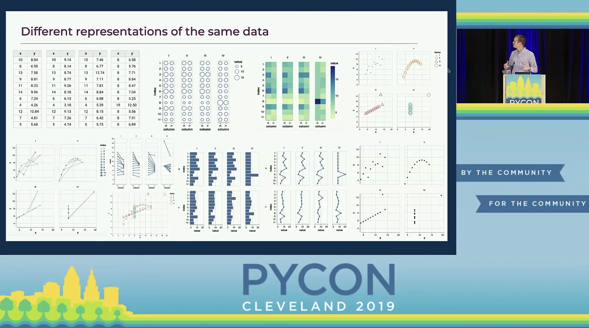

# Visualize Anscombe's quartet with the seaborn.objects interface

This is a little exercise I did to use the new [seaborn.objects interface](https://seaborn.pydata.org/tutorial/objects_interface.html) to recreate (almost) all the [Vega-Altair](https://altair-viz.github.io/) plots from this talk [Jake VanderPlas - How to Think about Data Visualization - PyCon 2019](https://www.youtube.com/watch?v=vTingdk_pVM).

